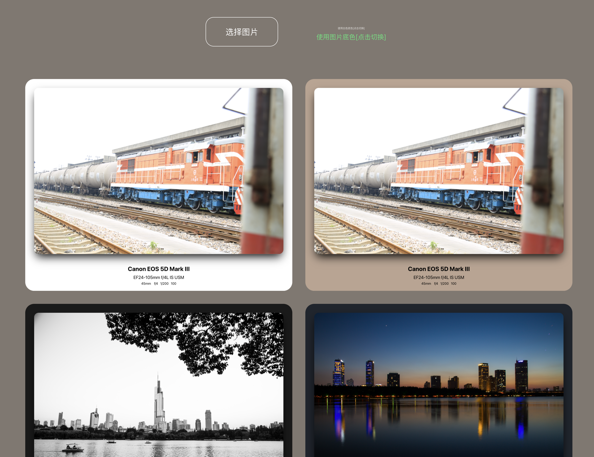

# photo-exif

相机 exif 框填充。默认白色底色，黑色文字。可根据图片主色调，改变底色。



## Project Setup

```sh
pnpm install
```

### Compile and Hot-Reload for Development

```sh
pnpm dev
```

### Type-Check, Compile and Minify for Production

```sh
pnpm build
```
